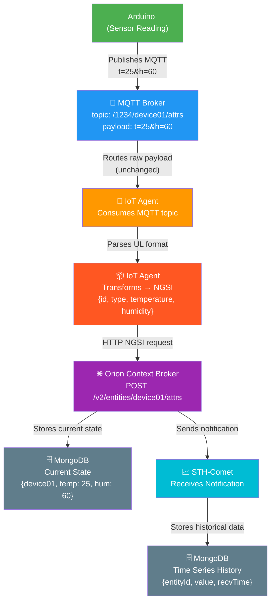
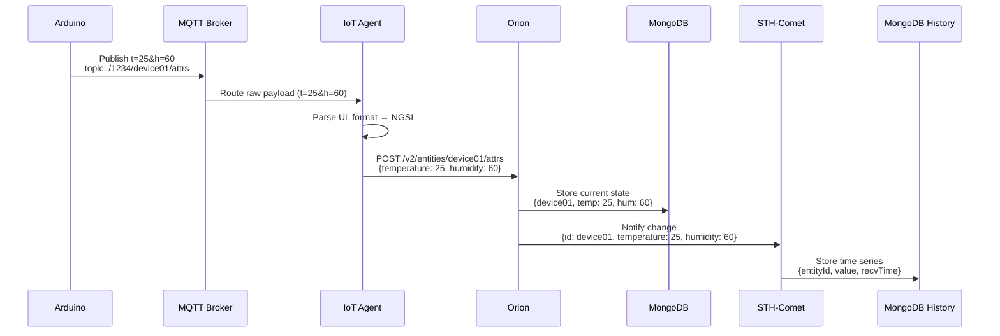

# FIWARE Data Flow

## Overview

### Steps

1. **Arduino collects data**
   *(no payload yet — internal sensor reading)*

---

2. **Publishes via MQTT (raw data)**

```json
topic: /1234/device01/attrs
payload: t=25&h=60
```

---

3. **MQTT Broker receives and distributes**
*(payload unchanged — just routing)*

---

4. **IoT Agent consumes the topic**
*(same payload received)*

```json
t=25&h=60
```

---

5. **IoT Agent transforms → NGSI (structured context)**

```json
{
  "id": "device01",
  "type": "Sensor",
  "temperature": {
    "value": 25,
    "type": "Number"
  },
  "humidity": {
    "value": 60,
    "type": "Number"
  }
}
```

---

6. **Sends to Orion (HTTP NGSI request)**

```http
POST /v2/entities/device01/attrs
Content-Type: application/json

{
  "temperature": { "value": 25, "type": "Number" },
  "humidity": { "value": 60, "type": "Number" }
}
```

---

7. Orion updates entity (current state)

```json
{
  "id": "device01",
  "type": "Sensor",
  "temperature": { "value": 25 },
  "humidity": { "value": 60 }
}
```

8. Orion stores in MongoDB (current state)

```json
{
  "_id": "device01",
  "temperature": 25,
  "humidity": 60,
  "lastUpdate": "2026-03-22T23:00:00Z"
}
```

9. Orion notifies STH-Comet

```json
{
  "data": [
    {
      "id": "device01",
      "temperature": { "value": 25 },
      "humidity": { "value": 60 }
    }
  ]
}
```

10. STH-Comet stores history (MongoDB)

```json
{
  "entityId": "device01",
  "attrName": "temperature",
  "value": 25,
  "recvTime": "2026-03-22T23:00:00Z"
}
```

### Flow Chart



### Sequence Diagram



### Quick summary

Before IoT Agent: raw data (t=25)
After IoT Agent: structured context (NGSI)
Orion: current state
STH-Comet: historical time series

## Scenario: 🌧️ Smart Flood Monitoring & Emergency Response

## Objective

Monitor flood risks in the city using:

- water level sensors
- rain intensity sensors
- geographic zones

Trigger alerts and support real-time decision-making.

---

## Entities

### WaterLevelSensor

- `level` (meters)
- `location` (geo:point)

### RainSensor

- `intensity` (mm or index)

### FloodZone

- `riskLevel` (LOW, MEDIUM, HIGH)

---

## Example Payloads

### Water sensor

topic: /city/water01/attrs
payload: level=2.3

### Rain sensor

topic: /city/rain01/attrs
payload: rain=80

---

## Core Rules

- **Heavy rain** → `rain > 70`
- **High water level** → `level > 2.0`
- **Flood risk** → rain + water high
- **Geo alert** → sensors near critical areas exceed threshold

---

## Possible Occurrences (Scenarios)

### 1. Normal Conditions

- Low rain and water levels
- Stable system
- No alerts

---

### 2. Gradual Rain Increase

- Rain rises slowly
- Water level follows
- Early warning triggered

---

### 3. Sudden Storm (Burst Event)

- All sensors update simultaneously
- High-frequency updates
- CPU spike due to:
  - multiple writes
  - rule evaluations
  - notifications

---

### 4. Flood Risk Detection

- Rain + water exceed thresholds
- FloodZone updated to `HIGH`
- Alerts triggered

---

### 5. Geo-Query Pressure

- Dashboard querying nearby sensors frequently
- Expensive spatial queries
- CPU and DB load increase

---

### 6. Combined Stress Scenario (Worst Case)

- Burst updates
- - geo queries
- - active subscriptions

Results:

- Orion CPU spikes
- MongoDB query slowdown
- Notification backlog

---

## What to Observe

- Orion CPU usage and latency
- MongoDB query performance (geo queries)
- Event processing delay
- Notification throughput

---

## Key Insight

This scenario stresses:

- **data ingestion (writes)**
- **real-time queries (reads)**
- **spatial processing (geo)**
